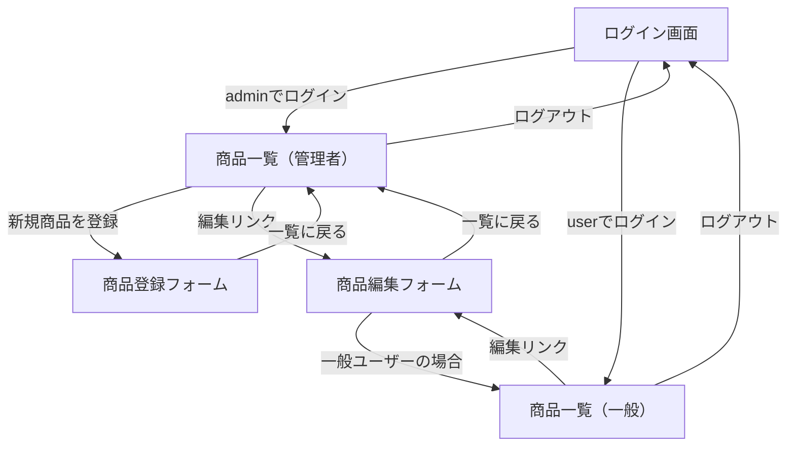

# 画面遷移図

# テストケース

この資料には各機能のテストケースを記載します。

## ログイン・ログアウト

|   |   |   |   |   |   |   |   |   |   |   |   |   |
|---|---|---|---|---|---|---|---|---|---|---|---|---|
|No|画面・機能|テスト観点|前提条件|入力値|手順|条件1|条件2|条件3|期待結果|結果|実施日|実施者|
|1|ログイン画面|正常系: 管理者ログイン|管理者アカウントが有効|ユーザーID=admin, パスワード=admin_password|1) ログイン画面を表示する 2) 上記を入力してログインを押下|-|ロール: 管理者|-|商品一覧（管理者）が表示され、「ログインしました。」のメッセージと「新規商品を登録」「削除」操作が利用可能になる|-|-|-|
|2|ログイン画面|正常系: 一般ユーザー権限制御|一般ユーザーアカウントが有効|ユーザーID=user, パスワード=user_password|1) ログイン画面を表示する 2) 上記を入力してログインを押下|-|ロール: 一般ユーザー|-|商品一覧が表示され、「新規商品を登録」リンクと削除ボタンが表示されない|-|-|-|
|3|ログイン画面|異常系: 認証失敗|なし|ユーザーID=admin, パスワード=wrong|1) ログイン画面を表示する 2) 誤ったパスワードでログインを押下|-|-|-|ログイン画面のまま「IDまたはパスワードが正しくありません。」が表示される|-|-|-|
|4|ログアウト機能|正常系: セッション終了|管理者で商品一覧を表示中|操作: ヘッダのログアウトボタン|1) 管理者でログイン済みの状態を用意する 2) ログアウトボタンを押下|-|-|-|ログイン画面へ遷移し「ログアウトしました。」が表示され、再読み込みしても商品一覧にアクセスできない|-|-|-|

## 商品一覧表示

|   |   |   |   |   |   |   |   |   |   |   |   |   |
|---|---|---|---|---|---|---|---|---|---|---|---|---|
|No|画面・機能|テスト観点|前提条件|入力値|手順|条件1|条件2|条件3|期待結果|結果|実施日|実施者|
|1|商品一覧|正常系: キーワード検索|管理者でログイン済み|キーワード=「テスト」|1) 商品一覧で検索欄に入力 2) 検索ボタンを押下|フィルタ: キーワード一致|-|-|商品名または説明に「テスト」を含む商品だけが表示され、件数が絞り込まれる|-|-|-|
|2|商品一覧|正常系: カテゴリ+価格帯検索|管理者でログイン済み|キーワード=空, カテゴリ=食品, 最低価格=1000, 最高価格=3000|1) 商品一覧で各条件を入力 2) 検索ボタンを押下|カテゴリ=食品|価格帯=1000～3000|-|条件を満たす商品（例: 集中力を保つ栄養バー）のみ表示される|-|-|-|
|3|商品一覧|異常系: キーワードによる500エラー再現|管理者でログイン済み|キーワード=「バグ票」|1) 検索欄に「バグ票」と入力 2) 検索ボタンを押下|既知不具合|エラー再現|-|商品一覧が表示され続けること（現在はRuntimeErrorが発生する既知不具合）|-|-|-|
|4|商品一覧|UI: 削除操作の確認有無|管理者でログイン済み|対象商品の削除ボタン|1) 任意の商品で削除ボタンを押下|-|既知不具合: 確認なし|-|削除前に確認ダイアログが表示されること（現状は即時削除される）|-|-|-|

## 商品登録・編集

|   |   |   |   |   |   |   |   |   |   |   |   |   |
|---|---|---|---|---|---|---|---|---|---|---|---|---|
|No|画面・機能|テスト観点|前提条件|入力値|手順|条件1|条件2|条件3|期待結果|結果|実施日|実施者|
|1|商品登録フォーム|正常系: 新規登録|管理者でログイン済み|商品名=「テスト商品999」等, カテゴリ=家電, 価格=1000, 在庫数=10, 説明=任意|1) 商品一覧から「新規商品を登録」を開く 2) 上記を入力して登録を押下|-|-|-|「商品を登録しました。」が表示され、一覧に新商品が追加される|-|-|-|
|2|商品登録フォーム|異常系: 価格の下限チェック|管理者でログイン済み|商品名=任意, 価格=-1, 在庫数=0 など|1) 必須項目を入力し価格に-1を設定 2) 登録を押下|境界値: 価格下限|-|-|エラーメッセージが表示され登録されないこと|-|-|-|
|3|商品編集フォーム|異常系: 禁止されたステータス遷移|管理者でログイン済み、対象商品が公開中|ステータス=公開中→準備中|1) 公開中の商品で編集を開く 2) ステータス「準備中」を選択し更新|-|-|-|「status: このステータスには変更できません。」が表示され更新されない|-|-|-|
|4|商品登録フォーム|セキュリティ: HTMLエスケープ|管理者でログイン済み|商品説明=|1) 新規登録または編集で商品説明にスクリプトを入力 2) 登録/更新を押下|-|既知不具合: XSS|-|商品説明はエスケープされスクリプトが実行されないこと（現状はXSSが成立）|-|-|-|